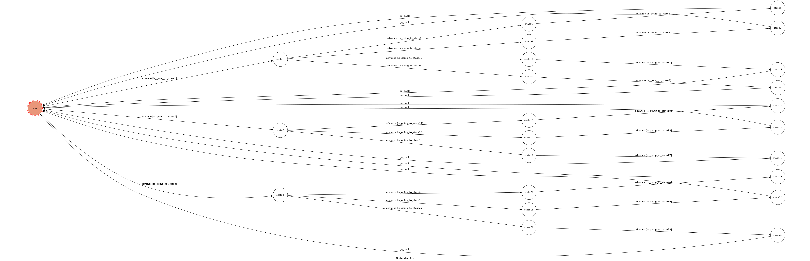

# TOC Project 2019

A Facebook messenger bot based on a finite state machine
這是一個台南附近美食推薦聊天機器人，透過搜尋知道等一下要吃啥~

## How to run the chatbot

### Prerequisite
* Python 3
* Facebook Page and App
* HTTPS Server

#### Install Dependency
```sh
pip3 install -r requirements.txt
```

* pygraphviz (For visualizing Finite State Machine)
    * [Setup pygraphviz on Ubuntu](http://www.jianshu.com/p/a3da7ecc5303)

#### Secret Data

`VERIFY_TOKEN` and `ACCESS_TOKEN` **MUST** be set to proper values.
Otherwise, you might not be able to run your code.

#### Run Locally
You can either setup https server or using `ngrok` as a proxy.

**`ngrok` would be used in the following instruction**

```sh
./ngrok http 5000
```

After that, `ngrok` would generate a https URL.

#### Run the sever

```sh
python3 app.py
```

## How to interact with chatbot
(1)The initial state is set to `user`.
(2)此聊天機器人不支援多人同時使用。
(3)若在某state輸入錯誤的字串，會在該state等待至輸入正確字串才會跳離該state。

* user
	1. 輸入: "麵" (有"飯"、"麵"、"牛肉湯"可選擇)
		* Reply: 
		```sh
        神武拉麵
        覺丸拉麵
        恭仔意麵
        ```

	2. 接著輸入: "神武拉麵" (有"神武拉麵"、"覺丸拉麵"、"恭仔意麵"可選擇)
		* Reply:
		```sh
        想吃神武拉麵嗎？
        附上位置與營業時間：
        https://www.google.com/maps/place/%E7%A5%9E%E6%AD%A6%E6%97%A5%E6%9C%AC%E6%8B%89%E9%BA%B5/@23.0120426,120.1930567,13z/data=!4m8!1m2!2m1!1z56We5q2m5ouJ6bq1!3m4!1s0x346e767b1867cbe5:0x4c47bd68bd198a52!8m2!3d22.9905971!4d120.197034
        ```
    3. 再輸入: "介紹"
        ```sh
        全品項拉麵都是無限加到爽,吃過CP值最高的拉麵
        ```
       
* 接著又返回user state，以此類推

## Finite State Machine

## Reference
[TOC-Project-2017](https://github.com/Lee-W/TOC-Project-2017) ❤️ [@Lee-W](https://github.com/Lee-W)
